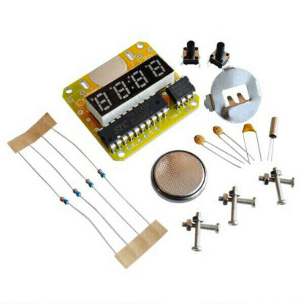
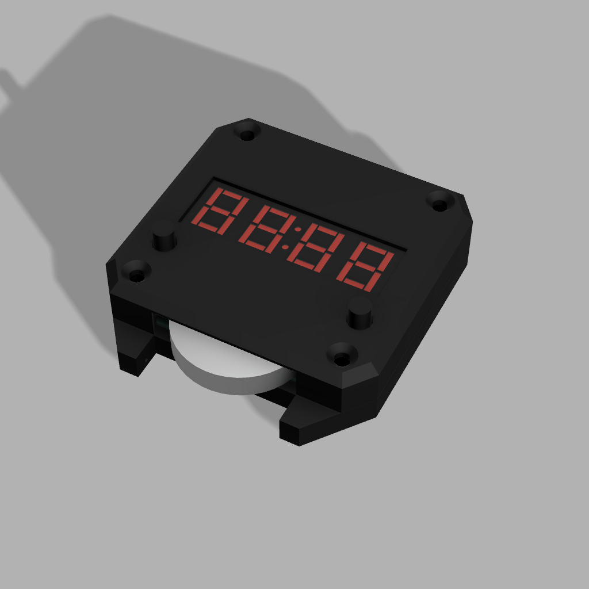
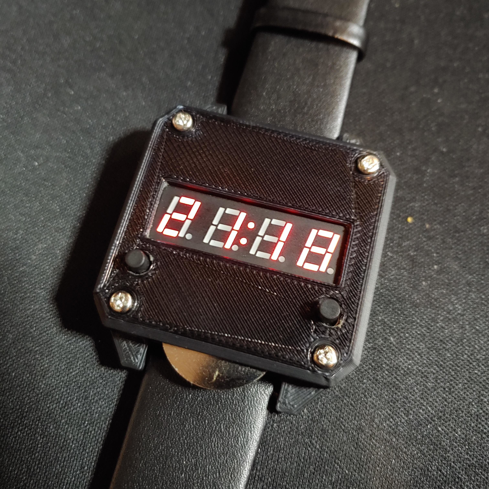
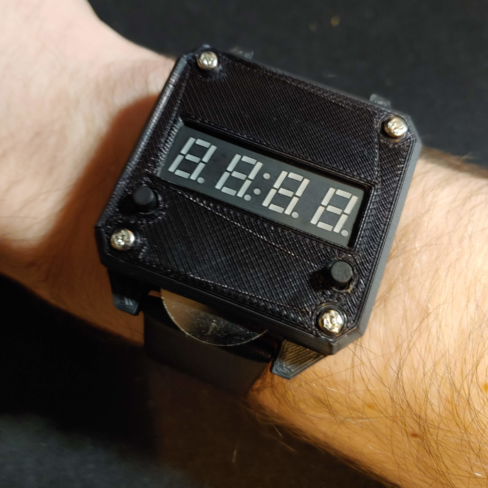

# 7 Segment Digital Watch

## Introduction

As a fun design challenge I decided to buy a DIY watch kit and design and 3D print an enclosure for it.

 

## CAD Enclosure

Both .f3d and .stl files for this design are included in the repository.

 

## Project Complete

While this is a large and impractical watch it was a fun, quick project.  

|  |  |
| --------------------------------- | --------------------------------- |